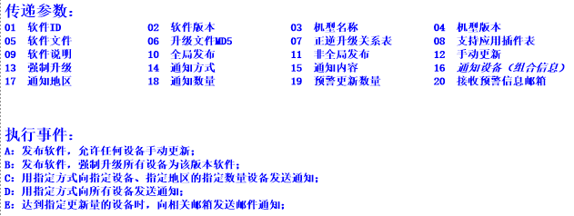

日常
=======

# 10
## 14
电脑坏了大半天。

## 15

### cloud-app

阅读 cloud-appconnector 源码。
AppService <del>的不同实现，比较性能的不同</del>

- Spring DAO 访问数据库
- Dubbo app->cloud方向，dispatcher调用
- Netty 与app的双向通信
- Socket cloud->app的通信方向

<del>*结论还不知道？*</del>
AppServices 的各种服务。

### Thrift Vs RESTful

* Thrift 可伸缩跨语言服务框架
* [RESTful][ws-restful]
> * 显式地使用 HTTP 方法。
  * 无状态。
  * 公开目录结构式的 URI。
  * 传输 XML、JavaScript Object Notation (JSON)，或同时传输这两者。
* [SOAP]

[soap]: http://zh.wikipedia.org/zh-cn/SOAP
[ws-restful]: http://www.ibm.com/developerworks/cn/webservices/ws-restful/

## 16

没有什么驱动力，学习效率很低，且都是在看没有动手去做，显得很难深入理解！

### 困境！

经常感到自己在虚度时光，日复一日，恍恍惚惚。感觉身处**困境**！
* 如何循序渐进的学习系统知识？
* 如何合理利用日常时间？

这可能是现阶段最需要思考的问题了。

### Dubbo

[Dubbo]是一个分布式服务框架，致力于提供高性能和透明化的RPC远程服务调用方案，以及SOA服务治理方案。

其核心部分包含:
* 远程通讯: 提供对多种基于长连接的NIO框架抽象封装，包括多种线程模型，序列化，以及“请求-响应”模式的信息交换方式。
* 集群容错: 提供基于接口方法的透明远程过程调用，包括多协议支持，以及软负载均衡，失败容错，地址路由，动态配置等集群支持。
* 自动发现: 基于注册中心目录服务，使服务消费方能动态的查找服务提供方，使地址透明，使服务提供方可以平滑增加或减少机器。

Dubbo能做什么？
* 透明化的远程方法调用，就像调用本地方法一样调用远程方法，只需简单配置，没有任何API侵入。
* 软负载均衡及容错机制，可在内网替代F5等硬件负载均衡器，降低成本，减少单点。
* 服务自动注册与发现，不再需要写死服务提供方地址，注册中心基于接口名查询服务提供者的IP地址，并且能够平滑添加或删除服务提供者。


[dubbo]: http://alibaba.github.io/dubbo-doc-static/Home-zh.htm
[dubbo-architecture]: http://shiyanjun.cn/archives/325.html

## 17

### 程序编译执行原理

今天听他们探讨程序语言，说到 Python 与 C++/Java 性能比较，Dictionary 的 Python 语言底层实现的优化性能要好于 C++ STL 的 map，
又说到 Python 自身的一些语言优势以及 CPython 解释器的底层 C 实现带来的崇拜光环。

对于这些一毛不知的我分外好奇，由此想从程序语言的编译执行过程原理的角度来解惑！就一个程序的执行的来龙去脉的过程的探究。

<!--- TODO: 程序执行过程-编译，链接，装载，执行 --->

### Netty

[Netty]提供异步的、事件驱动的网络应用程序框架和工具，用以快速开发高性能、高可靠性的网络服务器和客户端程序。

* Netty NIO 框架
* 源码级实现原理

<!--- TODO --->

[netty]: http://netty.io/3.8/guide/#preface.3

## 20

### appconnector

APP Push API 中的 pushEven:newApp|newPureMessage 的实现

## 22

### push了解

透传，即是透明传送，也就是传送网络不管传输的业务如何，只负责将需要传送的业务传送到目的节点，
同时保证传输的质量即可，而不对传输的业务进行处理。

## 24

### ip-location中BMap的标记容量上线

BMap所能展示的标记是有限的，我把所有坐标存在一个`array[]`里，长度超过1W+便出现js脚本无响应。
所以，地图上标记过多而无法正常显示。尚未找到合适的解决方案。

<!---TODO: ip-location 地图标签过多无法显示的问题--->

### EasyMock

学习使用单元测试工具，[EasyMock]

> 通过 EasyMock，我们可以为指定的接口动态的创建 Mock 对象，并利用 Mock 对象来模拟协同模块或是领域对象，从而使单元测试顺利进行。这个过程大致可以划分为以下几个步骤：
  * 使用 EasyMock 生成 Mock 对象；
  * 设定 Mock 对象的预期行为和输出；
  * 将 Mock 对象切换到 Replay 状态；
  * 调用 Mock 对象方法进行单元测试；
  * 对 Mock 对象的行为进行验证。

```java
public class SalesOrderTestCase extends TestCase {
  public void testSalesOrder() {
    IMocksControl control = EasyMock.createControl();
    //......
    ResultSet mockResultSet = control.createMock(ResultSet.class);
    try {
      //......
      mockResultSet.next();
      expectLastCall().andReturn(true).times(3);
      expectLastCall().andReturn(false).times(1);
      mockResultSet.getString(1);
      expectLastCall().andReturn("DEMO_ORDER_001").times(1);
      expectLastCall().andReturn("DEMO_ORDER_002").times(1);
      expectLastCall().andReturn("DEMO_ORDER_003").times(1);
      mockResultSet.getString(2);
      expectLastCall().andReturn("Asia Pacific").times(1);
      expectLastCall().andReturn("Europe").times(1);
      expectLastCall().andReturn("America").times(1);
      mockResultSet.getDouble(3);
      expectLastCall().andReturn(350.0).times(1);
      expectLastCall().andReturn(1350.0).times(1);
      expectLastCall().andReturn(5350.0).times(1);
      control.replay();
      //......
      int i = 0;
      String[] priceLevels = { "Level_A", "Level_C", "Level_E" };
      while (mockResultSet.next()) {
        SalesOrder order = new SalesOrderImpl();
        order.loadDataFromDB(mockResultSet);
        assertEquals(order.getPriceLevel(), priceLevels[i]);
        i++;
      }
      control.verify();
    } catch (Exception e) {
      e.printStackTrace();
    }
  }
}
```

[easymock]: http://www.ibm.com/developerworks/cn/opensource/os-cn-easymock/


## 27

### 阻塞/非阻塞、同步/异步、IO模型

[概念辨析][bio-nio-sync-async]


[bio-nio-sync-async]: http://blog.csdn.net/hguisu/article/details/7453390


### CountDownLatch 同步辅助类

CountDownLatch是一个同步辅助类，犹如倒计时计数器，创建对象时通过构造方法设置初始值，
调用CountDownLatch对象的await()方法则处于等待状态，调用countDown()方法就将计数器减1，
当计数到达0时，则所有等待者或单个等待者开始执行。

```java
package com.thread;
import java.util.concurrent.CountDownLatch;
import java.util.concurrent.CyclicBarrier;
import java.util.concurrent.ExecutorService;
import java.util.concurrent.Executors;
/**
 *
 * @author Administrator
 *该程序用来模拟发送命令与执行命令，主线程代表指挥官，新建3个线程代表战士，战士一直等待着指挥官下达命令，
 *若指挥官没有下达命令，则战士们都必须等待。一旦命令下达，战士们都去执行自己的任务，指挥官处于等待状态，战士们任务执行完毕则报告给
 *指挥官，指挥官则结束等待。
 */
public class CountdownLatchTest {

    public static void main(String[] args) {
        ExecutorService service = Executors.newCachedThreadPool(); //创建一个线程池
        final CountDownLatch cdOrder = new CountDownLatch(1);//指挥官的命令，设置为1，指挥官一下达命令，则cutDown,变为0，战士们执行任务
        final CountDownLatch cdAnswer = new CountDownLatch(3);//因为有三个战士，所以初始值为3，每一个战士执行任务完毕则cutDown一次，当三个都执行完毕，变为0，则指挥官停止等待。
        for(int i=0;i<3;i++){
            Runnable runnable = new Runnable(){
                    public void run(){
                    try {
                        System.out.println("线程" + Thread.currentThread().getName() +
                                "正准备接受命令");
                        cdOrder.await(); //战士们都处于等待命令状态
                        System.out.println("线程" + Thread.currentThread().getName() +
                        "已接受命令");
                        Thread.sleep((long)(Math.random()*10000));
                        System.out.println("线程" + Thread.currentThread().getName() +
                                "回应命令处理结果");
                        cdAnswer.countDown(); //任务执行完毕，返回给指挥官，cdAnswer减1。
                    } catch (Exception e) {
                        e.printStackTrace();
                    }
                }
            };
            service.execute(runnable);//为线程池添加任务
        }
        try {
            Thread.sleep((long)(Math.random()*10000));

            System.out.println("线程" + Thread.currentThread().getName() +
                    "即将发布命令");
            cdOrder.countDown(); //发送命令，cdOrder减1，处于等待的战士们停止等待转去执行任务。
            System.out.println("线程" + Thread.currentThread().getName() +
            "已发送命令，正在等待结果");
            cdAnswer.await(); //命令发送后指挥官处于等待状态，一旦cdAnswer为0时停止等待继续往下执行
            System.out.println("线程" + Thread.currentThread().getName() +
            "已收到所有响应结果");
        } catch (Exception e) {
            e.printStackTrace();
        }
        service.shutdown(); //任务结束，停止线程池的所有线程

    }
}
/* result
线程pool-1-thread-2正准备接受命令
线程pool-1-thread-3正准备接受命令
线程pool-1-thread-1正准备接受命令
线程main即将发布命令
线程pool-1-thread-2已接受命令
线程pool-1-thread-3已接受命令
线程pool-1-thread-1已接受命令
线程main已发送命令，正在等待结果
线程pool-1-thread-2回应命令处理结果
线程pool-1-thread-1回应命令处理结果
线程pool-1-thread-3回应命令处理结果
线程main已收到所有响应结果
 */
```
## 28

### pushComputeService

消息参数



### 禅道zentao

* [禅道phpmysql](http://172.29.88.111:88/phpmyadmin)
* [禅道入口](http://172.29.88.111:88/zentao)
* [禅道文档](http://www.zentao.net/book/zentaopmshelp.html)

# 11
## 20

### mysql 查询

从上面的测试结果，可以看出如果in和or所在列有索引或者主键的话，or和in没啥差别，执行计划和执行时间都几乎一样。
如果in和or所在列没有索引的话，性能差别就很大了。在没有索引的情况下，随着in或者or后面的数据量越多，
in的效率不会有太大的下降，但是or会随着记录越多的话性能下降非常厉害。

http://blog.chinaunix.net/uid-20639775-id-3416737.html

## 21

### BUG

# 2015.5

这一年时间过去的好快啊！

## 19

持续2周多的时间，做一个基于BMap API中[BMap.RichMarker][]的地图应用，主要的问题集中在两个方面：

1. JS 方面一些知识的不了解，特别是反射机制。还有本次用到的前端框架[Ext.js][] 的一些经验；
2. Java SSH 方面，struts 的知识不太明了。

[BMap.RichMarker](http://api.map.baidu.com/library/RichMarker/1.2/docs/symbols/BMapLib.RichMarker.html)
[Ext.js](http://docs-origin.sencha.com/extjs/4.2.1/#)

## 20

一天就在提交Map的应用的CodeReview，配合Manager模块负责人更改些规范和习惯，合并到Manager中。

发现一天的无所事事全都是由于无计划无目标的原因。缺少目的性就会让人彷徨失措。

## 21

还好这无聊的日子里可以听Huawei来的勇哥水水正规的软件开发流程。之前有开玩笑说勇哥三大宝，Huawei，存储，股票。 :-)

一直想要把自己的推送模块代码写的更规范下，可是忽略很重要的地方。不该埋头自己死研，开阔眼界，多看看业界现有的经验，会给自己开发带来很多灵感和启发，自己拍脑袋想很傻！

时间总是飞快，恭喜，我又呆了一天！

## 22 又到Friday

我想该是要系统规划些了。

## 26

### url 中文编码/解码

```java
for (String enType : new String[] { "utf-8", "gbk","gb2312" }) {
    String testString = "测试代码Code";
    String urlStr = java.net.URLEncoder.encode(testString, enType);
    System.out.println(enType);
    System.out.println(urlStr);
    System.out.println(java.net.URLDecoder.decode(urlStr, enType));
}

/* out
utf-8
%E6%B5%8B%E8%AF%95%E4%BB%A3%E7%A0%81Code
测试代码Code
gbk
%B2%E2%CA%D4%B4%FA%C2%EBCode
测试代码Code
gb2312
%B2%E2%CA%D4%B4%FA%C2%EBCode
测试代码Code
*/
```

字符串`测试代码Code`的各种URL编码方式

encoding | url str
-----    | -----
utf-8    | %E6%B5%8B%E8%AF%95%E4%BB%A3%E7%A0%81Code
gbk      | %B2%E2%CA%D4%B4%FA%C2%EBCode
gb2312   | %B2%E2%CA%D4%B4%FA%C2%EBCode

# 2015.6

## 2

java 序列化 `Serializable`

序列化受到继承的影响，父类属性要被序列化需要实现`Serializable`